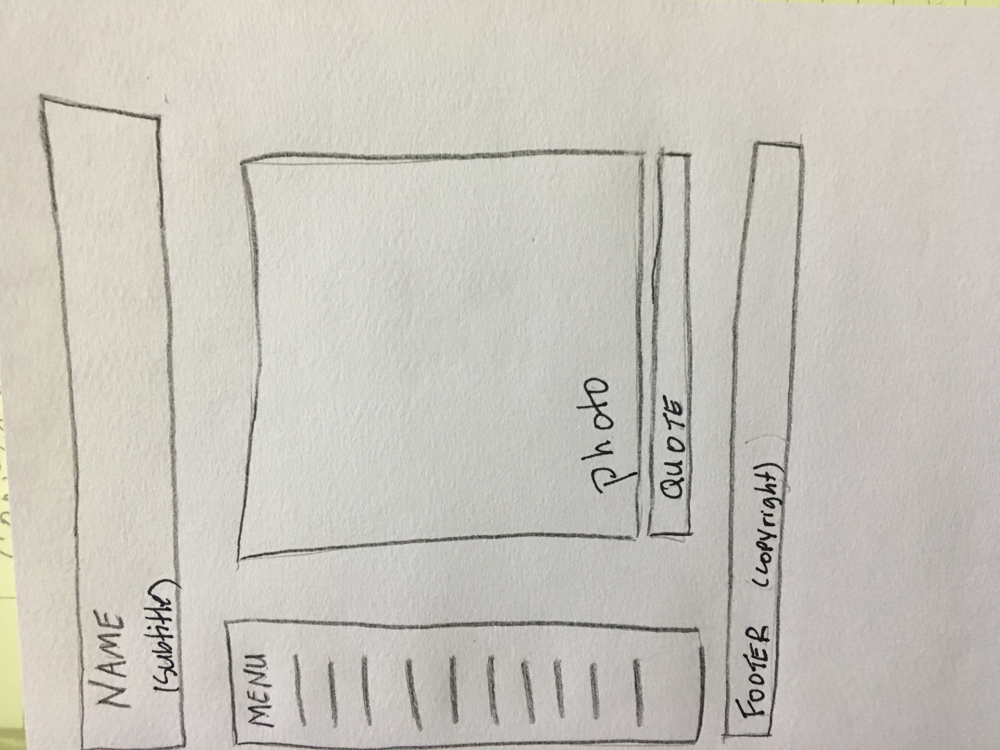
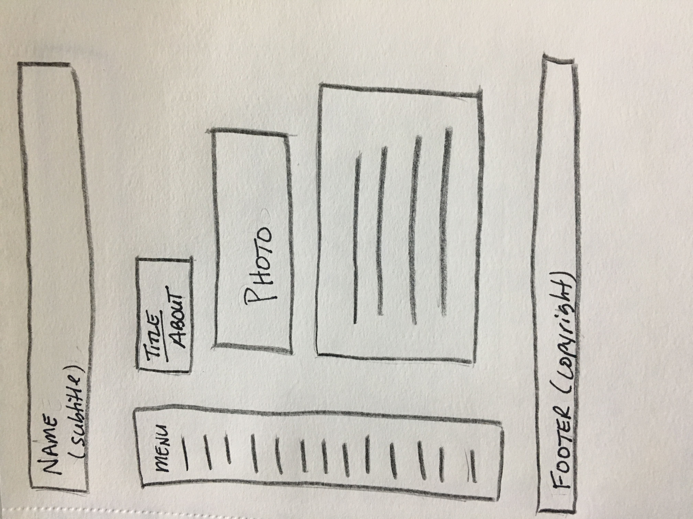
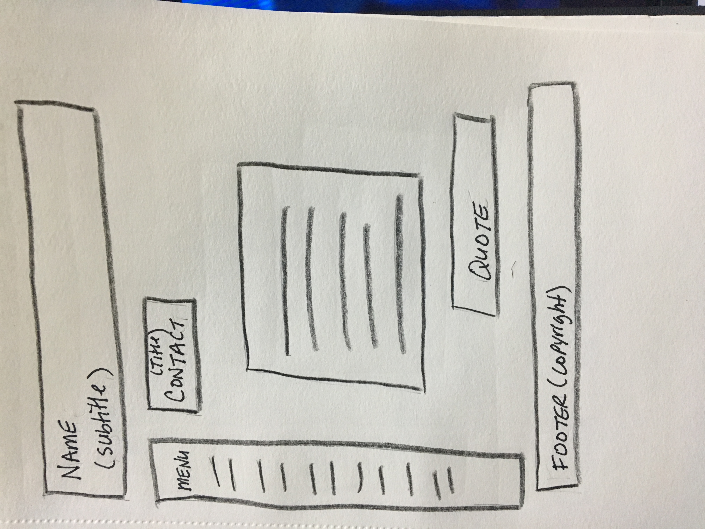

# INF 7420 Project

For this project I am going to build a portfolio site. This site will contain work I created from each course of the program.

## Wireframes

In order to build a site, I first planned layout pages. These wireframes show what the layout may be.

Header - will include my name and subtitle

Navigation Menu - will include links to other pages like an about page

Main Content - will be a photo and a quote

Footer - will include copyright information

Header - will include my name and subtitle

Navigation Menu - will include links to other pages like landing page

Main Content - will a photo of me and talk about who I am

Footer - will include copyright information

Header - will include my name and subtitle

Navigation Menu - will include links to other pages like an about page

Main Content - will include how to contact me

Footer - will include copyright information